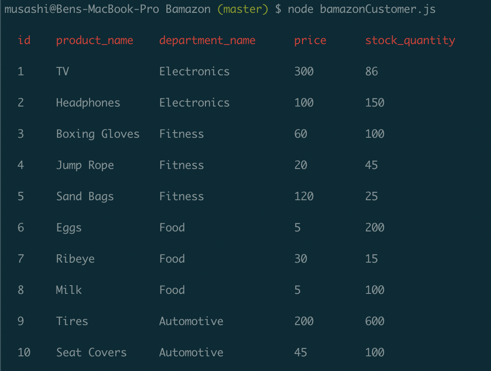
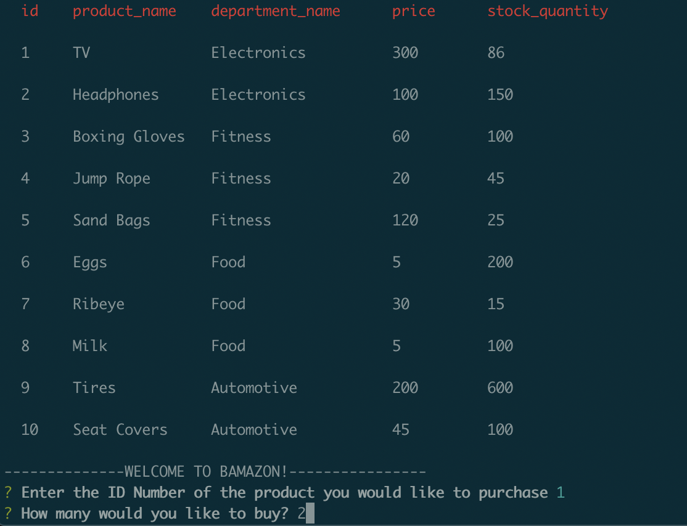
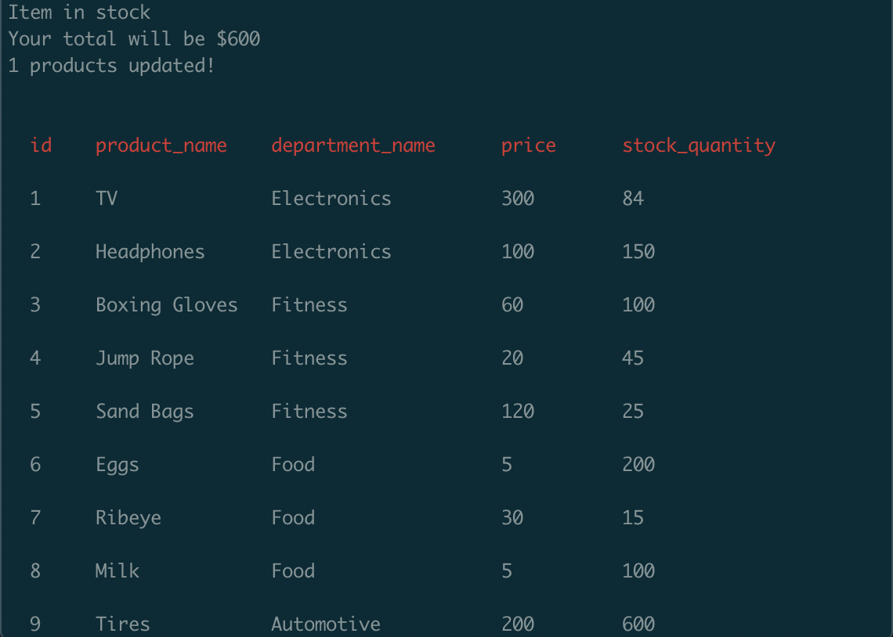
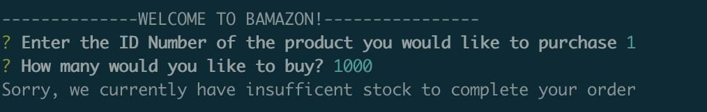

# Bamazon
## Overview
The Bamazon App is a mock Amazon application that allows the user to see a list of inventory, decide which item to buy, and how many, and updates the inventory based on the User input.
## How to Use Bamazon
1. To initiate Bamazon, enter "node bamazonCustomer.js". This will display a table of the current inventory, including; the item id number, the product's name, the department that the product is in, the price, and the current stock.

2. The user will then be welcomed to Bamazon and asked to input the id number of the item they would like to purchase. After inputting a number (letters will not work), Bamazon will then ask the user to input the quantity.

3. Bamazon will then check to see if that item has enough stock to fulfill the user's order. If it does, Bamazon will show the total cost of the items and update the table.

4. If there are not enough units to fulfill the user's request, Bamazon will alert the user and ask for a new id and quantity input.

## Technology Used
The primary technology used is node and mysql. Node allows the user to navigate Bamazon. The inventory list is held in a database on mysql. NPM packages were also used to make this app function properly. Inquirer allows the developer to propose questions and gather information from the user. CLI-Table made the inventory list more visually appealing. 
## My Role
This is a solo project. As the only developer, I analyzed and interpreted the needs, wants, and requirements of the Product Owner (Trilogy) and created a functioning application from top to bottom that met those expectations.
